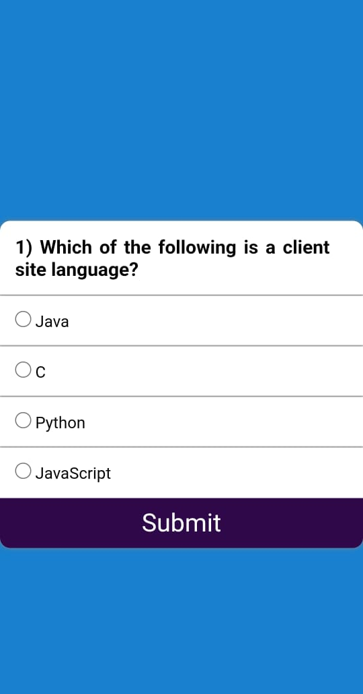

# Quiz App

An interactive and responsive **Quiz Application** built using **HTML, CSS, and JavaScript**.
This project allows users to test their knowledge by answering multiple-choice questions and instantly view their final score.

The app provides a clean user interface and a smooth quiz experience.

---

## Live Demo

https://codewithaman-dev.github.io/Quiz-App/

---

## Features

* Multiple-choice quiz questions
* Instant answer validation
* Automatic score calculation
* Clean and user-friendly interface
* Responsive design for different screen sizes

---

## Tech Stack Used

* HTML5
* CSS3
* JavaScript
* Git & GitHub

---

## Project Structure

Quiz-App
│── index.html
│── style.css
│── script.js
│── README.md

---

## Screenshot

---

## GitHub Repository

 LinkedIn: https://www.linkedin.com/in/aman-jangid-3b2796327
 
 GitHub: https://github.com/codewithaman-dev

---

⭐ If you like this project, please give it a **star** on GitHub.
